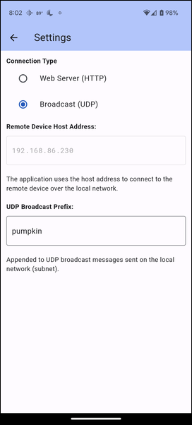

# Glowing Pumpkin Server (UDP)

This is the [Glowing Pumpkin Xiao 5x5 BFF](https://github.com/johnwargo/glowing-pumpkin-xiao-bff) project with a UDP broadcast listener added to you can control the LEDs from a smartphone, tablet, of desktop PC. The original project changed colors randomly and periodically flashed the LEDs white to simulate sparks or lightning. 

This is slightly modified from [Glowing Pumpkin Server (HTTP)](https://github.com/johnwargo/glowing-pumpkin-server-http); this version uses UDP Broadcast messages to send commands to turn the LEDs on and off, etc, but it commands multiple devices simultaneously. My goal with this version is to setup multiple pumpkins in dormers in my house and have them all doing the same thing at the same time.

The project runs on a [Seeed Studio Xiao ESP32 device](https://www.seeedstudio.com/xiao-series-page) with a [5x5 NeoPixel array](https://www.adafruit.com/product/5646). You can use any other device and LED configuration if you want using this project as a starting point, but the web server is specific to the ESP32 device family, so that limits your microcontroller options. 

## The API

The API exposed through the web server looks like this:

| Method       | Description |
| ------------ | ----------- |
| `/color:#`   | Lights all of the NeoPixels with a specific color. The command accepts a single parameter, the array index for the selected color. So, for example, to illuminate all of the LEDs Purple, the command is `color:3` as Purple is the 4th color in the array (with an index of 3 since C arrays start at 0). To illuminate the LEDs Blue, the command is `color:0`. |
| `/flash:#:#` | Flash the LED matrix a specific color a specific number of times. For example, to flash the LED matrix Blue three times, the command is `flash:0:3`. |
| `/lightning` | Flash the LED matrix White a random number of times for a random amount of time for each flash in an attempt to simulate lightning or electrical flashes inside the pumpkin. |
| `/off`       | Turns off the LED Matrix (sets all NeoPixels to `CRGB::Black`). |
| `/random`    | Enables random mode where the ESP32 device randomly picks a color from the array and displays it for a random amount of time (seconds) before picking another color and starting all over again. |

## The App

The sample app I published for the HTTP version ([Glowing Pumpkin Controller](https://github.com/johnwargo/glowing-pumpkin-controller-html/tree/main)) doesn't work with this project; I didn't recode it to support UDP.  To control this device, you must send your own UDP broadcast messages in the right format, or you can use the [Pumpkin Controller (Flutter)](https://github.com/fumblystuff/pumpkin-controller-app-flutter) on a phone or tablet.

Here's a screenshot of the mobile app, you basically tap buttons and it makes corresponding stuff happen on compatible devices nearby. 


To use the app with the UDP server, in the app tap the gear icon in the upper-right corner of the app and enable the Broadcast (UDP) **Connection Type**. 

The app defaults to prepending `pumpkin::` to every API request so the sketch expects that. If you change the `BROADCAST_PREFIX` constant in the sketch for any reason, you must also change it in the app's configuration in the **UDP Broadcast Prefix** in the app.



Tap the left-facing arrow to return to the app's home page.

## Wi-Fi and Wi-Fi Settings

The web server connects to a Wi-Fi network, so the first thing you must do is provide the project sketch with the local network credentials. In the repository, you'll see a file called `constants.h.rename`; rename that file to `constants.h` then open the file in the Arduino IDE. 

The file currently looks like this:

```c
#define WIFI_SSID ""
#define WIFI_PASSWORD ""
```

Edit the file and add the local Wi-Fi network [SSID](https://en.wikipedia.org/wiki/Service_set_(802.11_network)#SSID) (network name) between the quotes in the `WIFI_SSID` define. Add the network access password between the quotes in the `WIFI_PASSWORD` define.  The file should look something like this but with your network name and password:

```c
#define WIFI_SSID "my_network_name"
#define WIFI_PASSWORD "my_password"
```

***

You can find information on many different topics on my [personal blog](http://www.johnwargo.com). Learn about all of my publications at [John Wargo Books](http://www.johnwargobooks.com).

If you find this code useful and feel like thanking me for providing it, please consider <a href="https://www.buymeacoffee.com/johnwargo" target="_blank">Buying Me a Coffee</a>, or making a purchase from [my Amazon Wish List](https://amzn.com/w/1WI6AAUKPT5P9).
