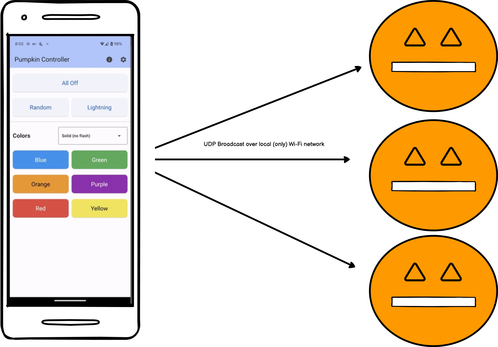
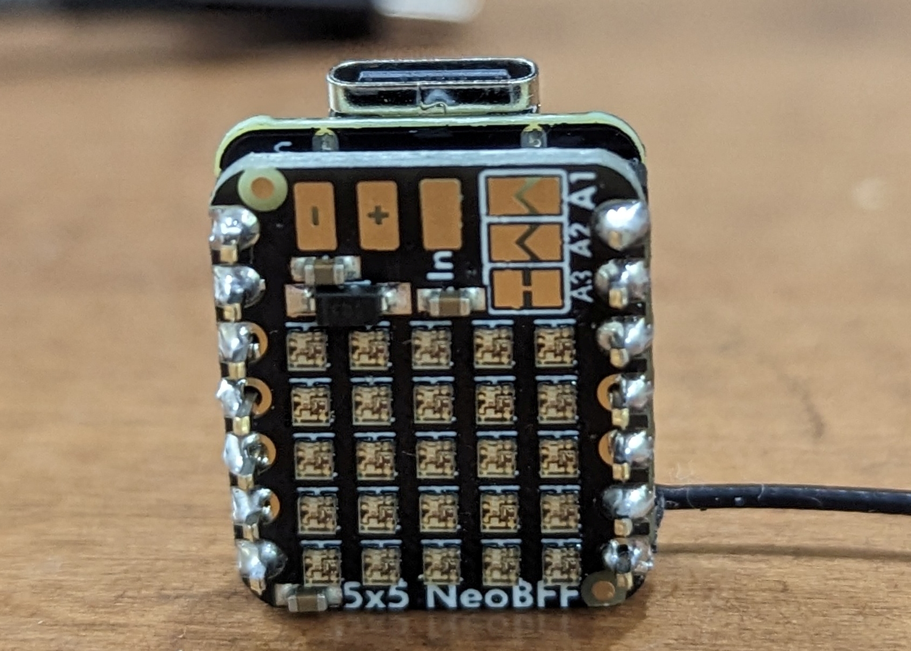

# Glowing Pumpkin Receiver (UDP)

This is the [Glowing Pumpkin Xiao 5x5 BFF](https://github.com/johnwargo/glowing-pumpkin-xiao-bff) project with a UDP broadcast listener added to you can control the LEDs from a smartphone or tablet application. The original project changed colors randomly and periodically flashed the LEDs white to simulate sparks or lightning. 

This is slightly modified from [Glowing Pumpkin Server (HTTP)](https://github.com/johnwargo/glowing-pumpkin-server-http); this version uses a mobile app to send UDP Broadcast messages on the network to multiple devices running this software. The app sends commands to the device to turn the LEDs on and off, etc., but controls multiple devices simultaneously because the app sends UDP broadcast messages. 



**Note:** You'll must build and deploy the mobile app ([Pumpkin Controller (Flutter)(https://github.com/fumblystuff/pumpkin-controller-app-flutter)])to use this project. I only tested this app on an Android device, I do not know if the code functions on iOS. If I get time over the holidays, I'll try to publish this to the Google App store and test it on iOS.

Here's a video of the [project in action](https://youtu.be/beevHJM8poQ).

## Parts

For this project, I used:

* [Seeed Studio XIAO ESP32S3](https://www.seeedstudio.com/XIAO-ESP32S3-p-5627.html)
* [Adafruit 5x5 NeoPixel Grid BFF Add-On for QT Py and Xiao](https://www.adafruit.com/product/5646)

The Adafruit 5x5 board comes pre-configured to connect to pin A3 on the Xiao, but supports other options as well. Refer to the Adafruit documentation for details.

## Assembly

Assembling the device is super easy, you can solder the device back to back (which is pretty cool) or you can use headers to connect them together. I used male headers to connect the two boards together as shown in the following figure.


It took me a while to figure out how to orient the two devices when connecting them together. When you put them together back to back, with the USB connector for the Xiao board pointing up, the 5x5 board should be facing up as well, with the text at the bottom and the power pads (`+` and `-` pads) at the top as shown in the following figure.



## Configuring Network Settings

To keep my network settings out of the repo and to keep from forcing you to modify the source code to configure your local network settings, I coded the sketch so it reads the Wi-Fi settings from a separate file called `constants.h`. Included in the repository is a filed called `constants.h.rename`; rename that file to `constants.h`  (basically by removing the `.rename`) from the end of the file name. Inside the file you'll find the following code:

```c
#define WIFI_SSID ""
#define WIFI_PASSWORD ""
```

Enter your local Wi-Fi network name (SSID) between the quotes in the `WIDI_SSID` define and the network password in the quotes in the `WIFI_PASSWORD` quotes. When you're done, it will look something like this (but with your network credentials):

```c
#define WIFI_SSID "My Network"
#define WIFI_PASSWORD "mynetworkpassword"
```

**Note:** Wi-Fi SSID and passwords are case sensitive, so if your device doesn't connect correctly to the network, double check the credentials.

## The Code

Normally I'd spend a lot of time here documenting everything I can tell you about the code. I'm not going to do that here because it's a lot of code to go through. I put a lot of comments in the code to help you understand what I did and why. If you have questions, ask them in an [issue](https://github.com/johnwargo/glowing-pumpkin-receiver-udp/issues) in this repository and I'll answer when I can.

I spent a fair amount of effort organizing the code into multiple files to make it easy to tell what's going on in the sketch. I also split the code onto separate processor cores. I did this partically to show off that I knew how to do that but also so I could dedicate the UDP listener to a dedicated processor core. While the sketch is messing around with the LEDs and such, the UDP listener gets all the processor cycles it needs to process incoming requests.

## The API

This sketch implements a listener/receiver, responding to commands from the mobile app. The API exposed through this sketch looks like this:

| Method       | Description |
| ------------ | ----------- |
| `/color:#`   | Lights all of the NeoPixels with a specific color. The command accepts a single parameter, the array index for the selected color. So, for example, to illuminate all of the LEDs Purple, the command is `color:3` as Purple is the 4th color in the array (with an index of 3 since C arrays start at 0). To illuminate the LEDs Blue, the command is `color:0`. |
| `/flash:#:#` | Flash the LED matrix a specific color a specific number of times. For example, to flash the LED matrix Blue three times, the command is `flash:0:3`. |
| `/lightning` | Flash the LED matrix White a random number of times for a random amount of time for each flash in an attempt to simulate lightning or electrical flashes inside the pumpkin. |
| `/off`       | Turns off the LED Matrix (sets all NeoPixels to `CRGB::Black`). |
| `/random`    | Enables random mode where the ESP32 device randomly picks a color from the array and displays it for a random amount of time (seconds) before picking another color and starting all over again. |

## The App

The sample app I published for the HTTP version ([Glowing Pumpkin Controller](https://github.com/johnwargo/glowing-pumpkin-controller-html/tree/main)) doesn't work with this project; I didn't recode it to support UDP.  To control this device, you must send your own UDP broadcast messages in the right format, or you can use the [Pumpkin Controller (Flutter)](https://github.com/fumblystuff/pumpkin-controller-app-flutter) on a phone or tablet.

Here's a screenshot of the mobile app, you basically tap buttons and it makes corresponding stuff happen on compatible devices nearby. 


To use the app with the UDP server, in the app tap the gear icon in the upper-right corner of the app and enable the Broadcast (UDP) **Connection Type**. 

The app defaults to prepending `pumpkin::` to every API request so the sketch expects that. If you change the `BROADCAST_PREFIX` constant in the sketch for any reason, you must also change it in the app's configuration in the **UDP Broadcast Prefix** in the app.


Tap the left-facing arrow to return to the app's home page.

***

You can find information on many different topics on my [personal blog](http://www.johnwargo.com). Learn about all of my publications at [John Wargo Books](http://www.johnwargobooks.com).

If you find this code useful and feel like thanking me for providing it, please consider <a href="https://www.buymeacoffee.com/johnwargo" target="_blank">Buying Me a Coffee</a>, or making a purchase from [my Amazon Wish List](https://amzn.com/w/1WI6AAUKPT5P9).
